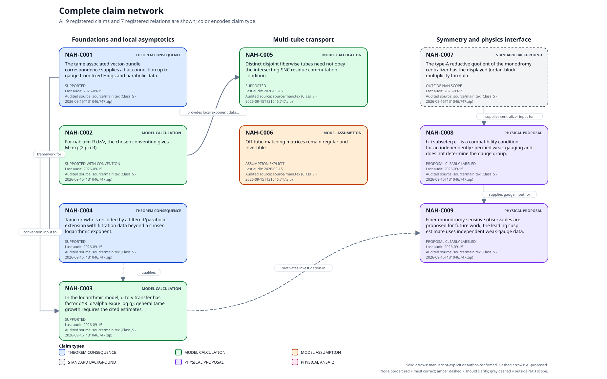

# Non-Abelian Hodge audit companion

Author: Amineh Mohseni

This companion uses AI to check mathematical claims involving non-Abelian
Hodge (NAH) theory in an imported manuscript against the mathematics papers
used as sources.

- **Permanent checkpoints.** The companion records relevant definitions,
  theorems, propositions, lemmas, and corollaries from primary mathematical
  sources as reusable checkpoints, with precise references, full hypotheses,
  conclusions, conventions, dependencies, and limitations. Audits reuse these
  checkpoints across manuscript revisions; substantive updates are dated
  and explained.
- **Mathematical completeness and physics-facing reporting.** The full
  mathematical assessment checks manuscript claims against the relevant
  checkpoints, examining hypotheses, conventions, applicability, and
  implications. A separate physics-facing action list reports only material
  corrections, preserving the manuscript's physical motivation, notation,
  and style. Simplifying the reporting does not weaken the mathematical
  assessment; harmless convention differences and optional formal
  refinements remain documented internally.
- **Claim map.** The map provides a navigation aid through the manuscript’s registered
  claims. Each registered claim appears as a node showing its type, audit status,
  audit date, and audited source. Solid arrows show relationships stated in the
  manuscript or confirmed by the authors; dashed arrows show AI-inferred relationships.
- **Approval for each correction.** `Edit` explains and displays one minimal
  correction at a time, applying it only after explicit author approval.

## Claim map

[](project/reports/CLAIM_NETWORK.svg)


## Use

Send the commands below as messages to the assistant, not at the shell prompt.

**In chat:** attach a ZIP of this companion and your manuscript ZIP.
Ask the assistant to extract the companion and read `project/AGENTS.md`,
then send:

```text
Import source relevant_NAH_manuscript.zip
```

**In terminal Codex:** use this companion's `project/` directory as the
working folder, then send:

```text
Import source ".../relevant_NAH_manuscript.zip"
```

Replace the example filename or path with your own.

Only `Import source` imports a manuscript: it unpacks into `project/source/`
and updates `project/SOURCE.md`. Later imports replace only `source/`,
preserving checkpoints and audit history.

Importing does not run an audit. Send `Audit` to check the draft's registered
NAH claims without editing, then `Map` to generate the network. Use `Edit`
for proposed corrections, each requiring explicit author approval.

After `Audit` and `Map` finish, their outputs and updated claim records are
saved in `project/`. No further command is needed.

## Contents

- `project/`: source references, checkpoints, claim records, and audits.
  Imported manuscript files are added to `project/source/`.
- `nah-audit/`: reusable workflow instructions and the map generator.

See the [project guide](project/PROJECT_GUIDE.md) for the file tour and full
command list. The source papers, authors, and versions are listed in the
[source manifest](project/papers/nah/SOURCE_MANIFEST.md).

The companion produces dated audit reports and a visual claim map.
Reports include the full mathematical assessment, concise physics-facing
findings, and a record of the checks performed.

[Latest included audit — 15 September 2026](project/audits/NAH_main_tex_reaudit_2026-09-15.md).

## Development history

- **July 2026:** Development of the companion and construction of mathematical checkpoints from primary sources ([source records](project/papers/nah/SOURCE_MANIFEST.md), [checkpoint workflow](project/knowledge/nah/provenance/CHECKPOINT_BUILD_RECORD.md)).
- **August 2026:** Continued [checkpoint development](project/knowledge/nah/sources/MOC04.md) and [audit-policy refinement](project/knowledge/nah/sources/DEL70.md).
- **15 September 2026:** Initial GitHub upload of the completed version of the companion.
